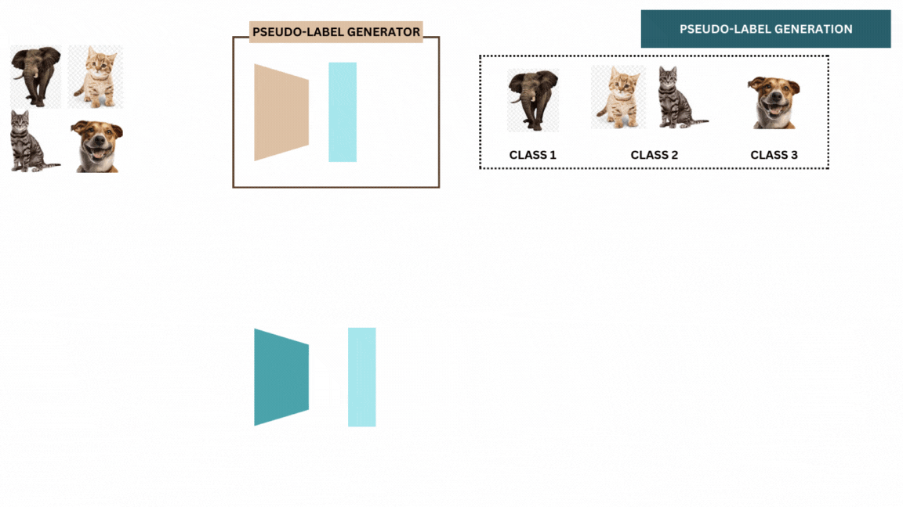

# IPCL: ITERATIVE PSEUDO-SUPERVISED CONTRASTIVE LEARNING TO IMPROVE SELF-SUPERVISED FEATURE REPRESENTATION.
### This [Paper](https://ieeexplore.ieee.org/document/10447607) is accepted in the 'IEEE International Conference on Acoustics, Speech and Signal Processing (ICASSP) 2024'
### Watch the IPCL presentation on [YouTube]( https://youtu.be/NveOLS1IB8Q)
<div align="center">
  
</div>

## Cite US
```
@INPROCEEDINGS{10447607,
  author={Kumar, Sonal and Phukan, Anirudh and Sur, Arijit},
  booktitle={ICASSP 2024 - 2024 IEEE International Conference on Acoustics, Speech and Signal Processing (ICASSP)}, 
  title={IPCL: Iterative Pseudo-Supervised Contrastive Learning to Improve Self-Supervised Feature Representation}, 
  year={2024},
  volume={},
  number={},
  pages={6270-6274},
  keywords={Representation learning;Visualization;Self-supervised learning;Signal processing;Image augmentation;Generators;Iterative methods;Self-supervised learning;representation learning;contrastive learning;unsupervised classification},
  doi={10.1109/ICASSP48485.2024.10447607}}
```
